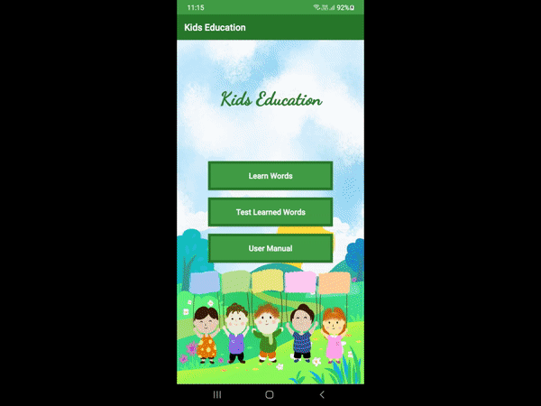

# Kids Education - Learning Platform

This is a Learning platform application for android. This application provides  words with images and audio of different available categories like Animals, Flowers, Alphabets, and many more to learn. There is also MCQ based quiz section.

## Features
- Learn words
- Audio of words pronunciation 
- Take word tests

## Getting Started
1) Clone Repository
2) Open project in android studio
3) run the project in physical device or on in virtual emulator

## Tools and Language Used
- Android Studio & SQLite  
- Java & XML

## Application Preview

## Contributing
Pull requests are welcome.  
For major changes, please open an issue first to discuss what you would like to change.
